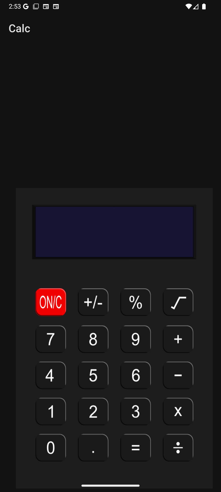
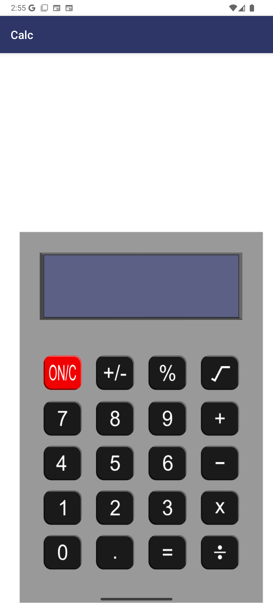
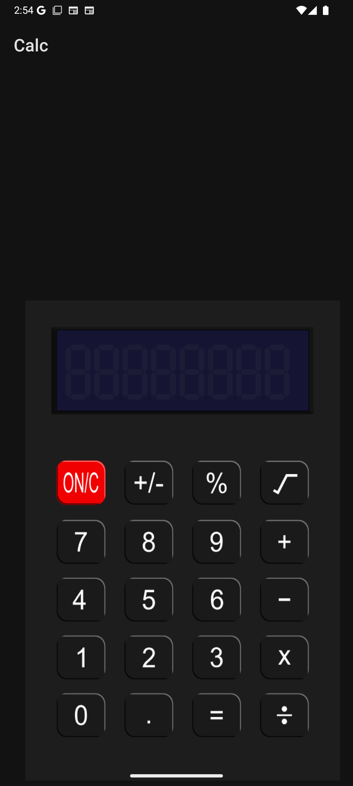
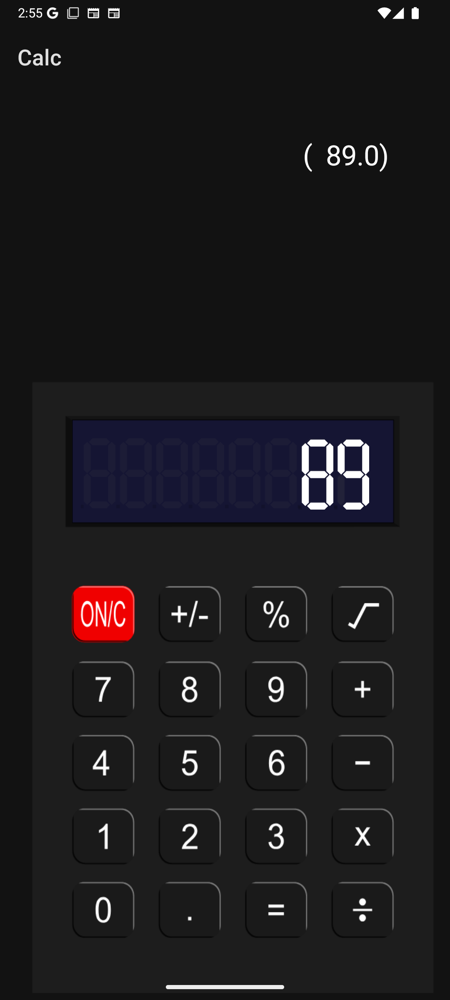
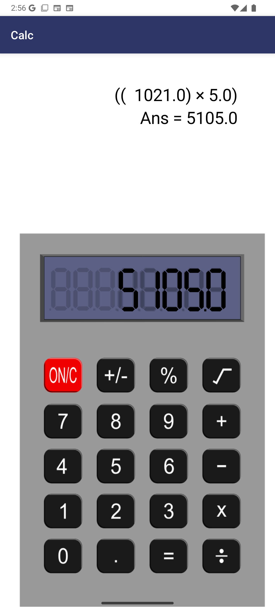
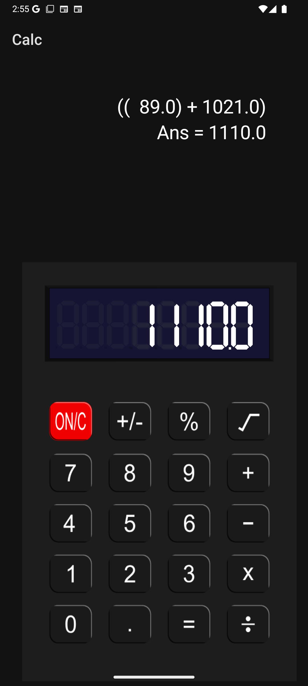

Sure thing! Here's a sample **README** file for your calculator app built in Java for Android. You can customize the details to suit your specific features or design choices:

---

# 📱 Calculator App

A simple and intuitive calculator app for Android, designed to perform basic arithmetic operations with a sleek interface and responsive user input handling.

## 🚀 Features

- Addition, subtraction, multiplication, and division
- Decimal input support
- Live display of input and result
- Clear functionality
- Responsive button interactions
- Lightweight and fast performance

## 🛠️ Tech Stack

- **Language:** Java  
- **Platform:** Android (API Level 31+)  

## 📸 Screenshots

-Display is blank without turning on
- 
- 

- When it is turned on standby display is shown.
- 

- 
- 
- 

## 💡 Usage

Tap ON to turn on the app.
Tap numeric buttons to input numbers and operators. Press equals (`=`) to calculate. Use clear (`C`) to reset.
